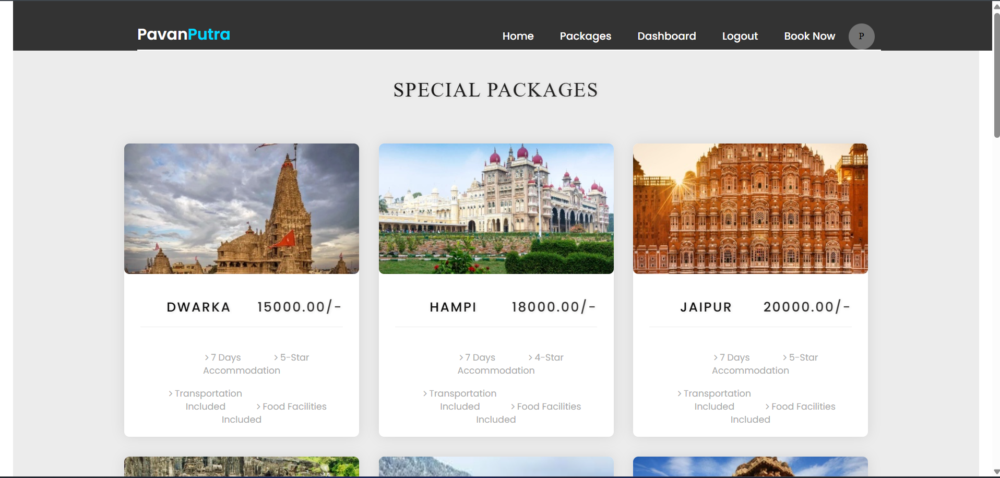
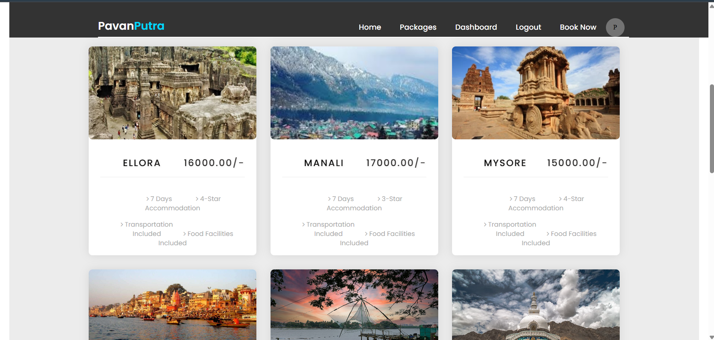
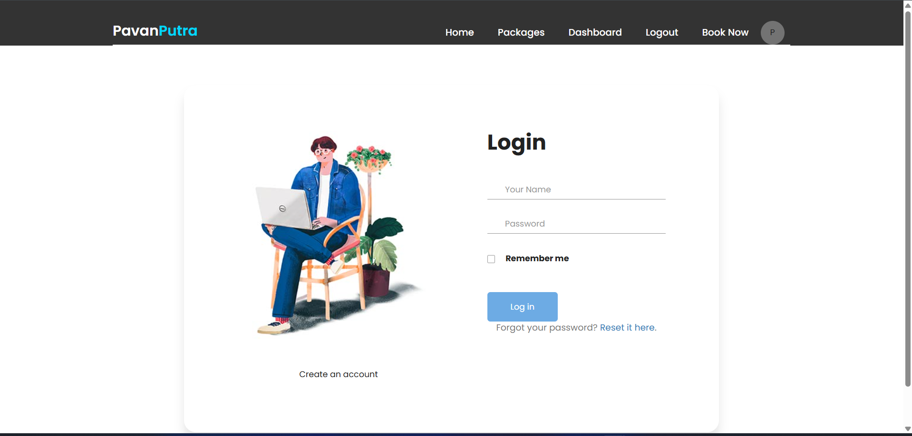
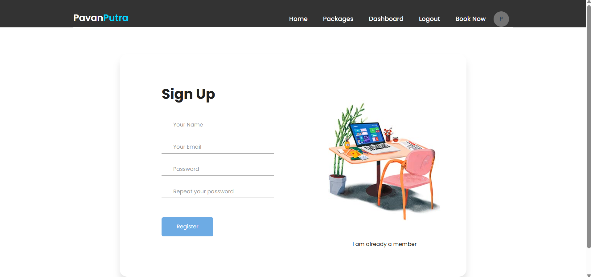

Pavanputra - Your Ultimate Travel Companion 🌍✈️
Welcome to Pavanputra, a feature-rich and user-friendly travel website designed to make trip planning effortless and enjoyable. Whether you're an adventurer, a backpacker, or a family vacationer, Pavanputra helps you find, book, and manage your trips seamlessly.

🌟 Key Features
✅ Tour & Travel Packages – Explore a wide range of travel destinations, curated packages, and exciting deals.
✅ Dynamic Flight Booking – Book flights with real-time departure dates and available slots.
✅ User Dashboard – View and manage your bookings easily.
✅ Group Booking Support – Plan trips with friends and family while ensuring availability.
✅ Secure Online Payments – Integrated with Stripe for a smooth and safe payment experience.

📌 Tech Stack
🔹 Frontend – HTML, CSS, JavaScript
🔹 Backend – Django (Python)
🔹 Database – SQLite/MySQL
🔹 Payment Gateway – Stripe pay

💡 Future Enhancements
🚀 AI-powered recommendations – Get personalized travel suggestions.

📢 Get Ready to Explore with Pavanputra!
Planning a trip? Pavanputra makes it hassle-free, secure, and fun!

🌍 Book your next adventure today! 🚀✈️

## Screenshots

Here are some screenshots showcasing the project:

### Screenshot 1

### Screenshot 2

### Screenshot 3

### Screenshot 4

### Screenshot 5

### Screenshot 6

### Screenshot 7

### Screenshot 8

### Screenshot 9

### Screenshot 10

### Screenshot 11

### Screenshot 12

### Screenshot 13

### Screenshot 14

### Screenshot 15

### Screenshot 16

### Screenshot 17

### Screenshot 18

### Screenshot 19

### Screenshot 20

### Screenshot 21

### Screenshot 22

### Screenshot 23

### Screenshot 24

### Screenshot 25

### Screenshot 26

### Screenshot 27

### Screenshot 28

### Screenshot 29

### Screenshot 30

### Screenshot 31

### Screenshot 32

